# **The Enchanted Forest**

The Enchanted Forest is a Python terminal game, which runs in the Code Institute mock terminal on Heroku. 

This is text based adventure game where users need to follow the on screen prompts and make the best decisions to win the game. 

This game is inspired by medieval legends about forests and forest creatures and animals. 

You can view the live website [here](https://the-enchanted-forest.herokuapp.com/).

 

## **How To Play**
This is a very straight forward game to play. 
The user reads the story lines on the screen, answer to the questions that pop up and make decisions as per their best judgment to win the game. 

## **Features**
### **Existing Features**
- **Welcome screen with ascii art** 
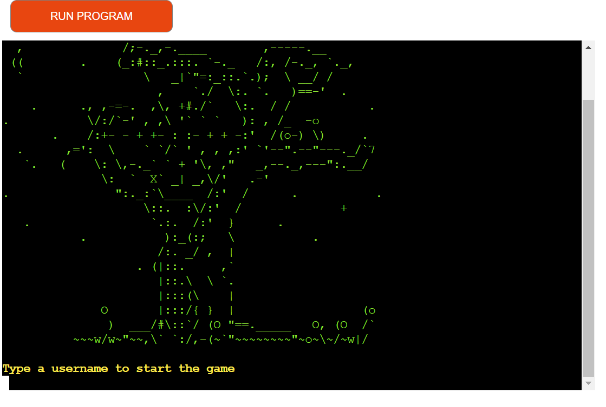 
This is a beautiful introduction on the game's theme where User is asked to input a user name.
On the second part of the welcome screen, users are asked to confirm if they want to play the game.
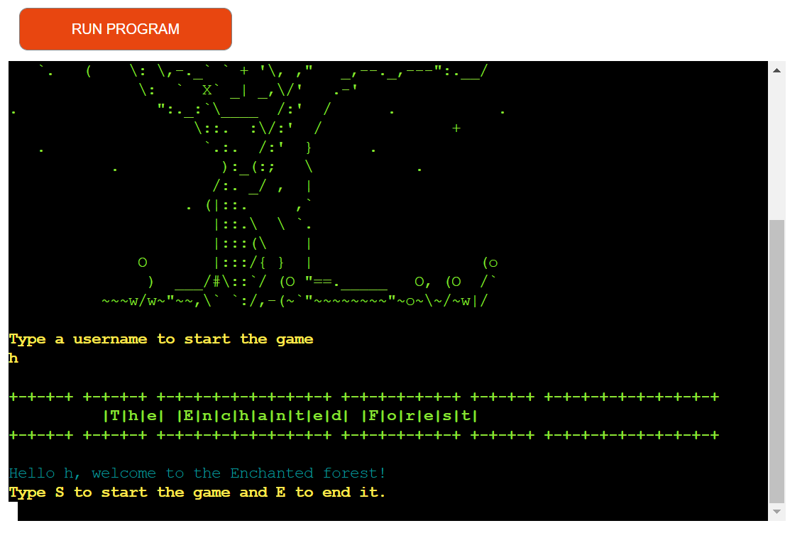 

- **Error handling** 
Throughout the game, I've included several error and exception handling features that notifies users when they made a wrong input and give them the option to make a correct input, otherwise they're sent to the beginning of the game. 
 

- **Colorama styles**
- I've implemented the Colorama module to make the screen more user friendly and to provide a visual feedback for the User.
For the main story lines I've chosen CYAN color.
When User input is requested, I've used Bright Yellow, that contrasts with the other colors and it catches User attention to focus on the task at hand. 
For the game_over function, I've selected red color
For the win_game function, I've selected Magenta color. 
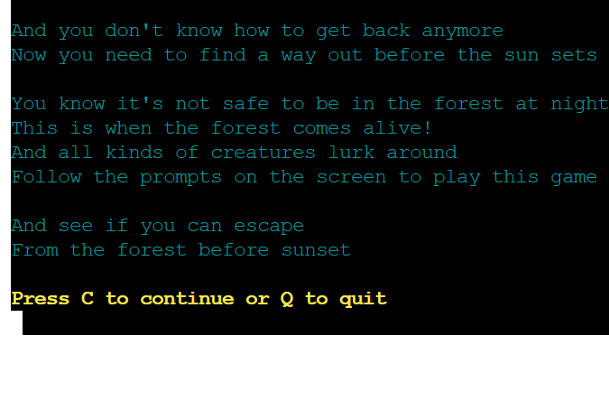 
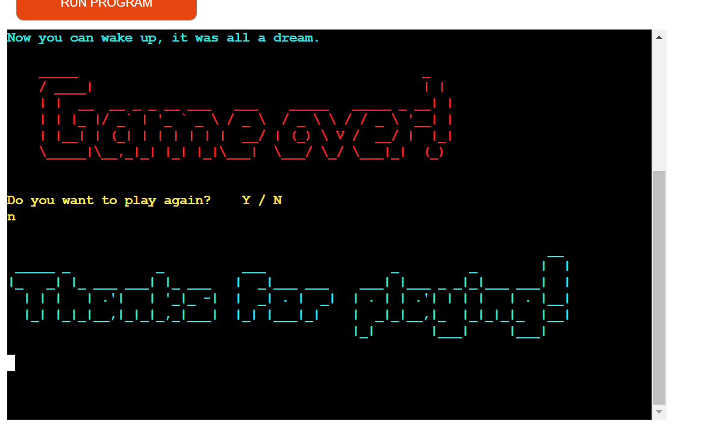
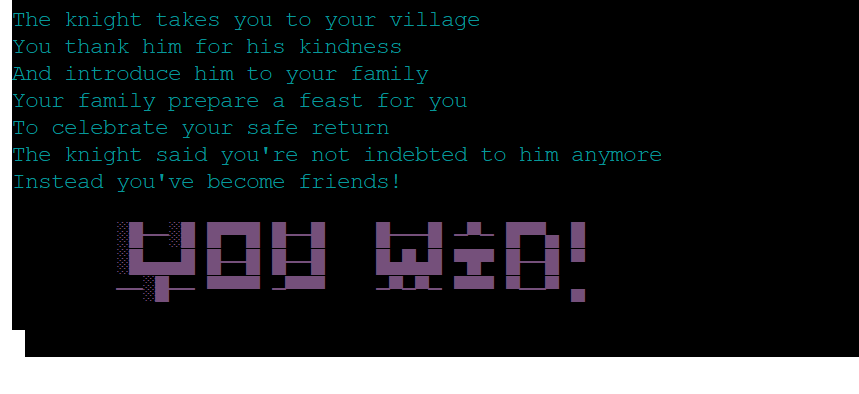  

- **Ascii art - text images**
In the pictures above, you see the text based images for win_game, play_game and start_game functions.
In addition to these, I've also included 2 more text based images for meet_deer and meet_knight functions, as seen below.

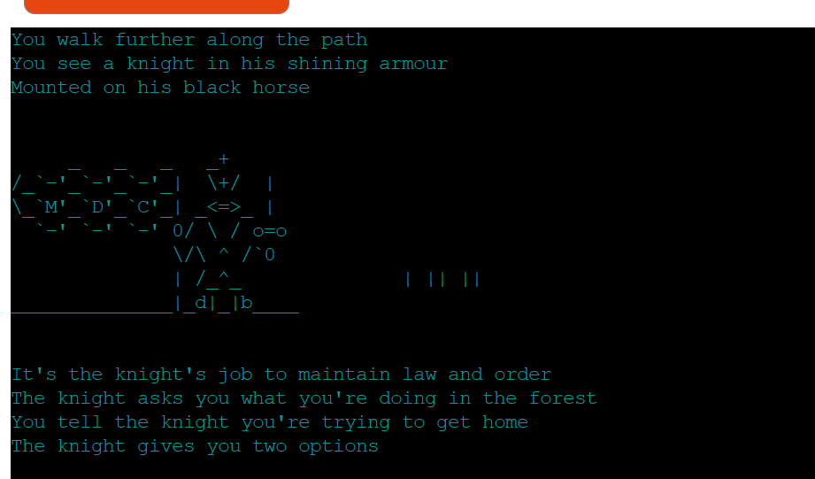 
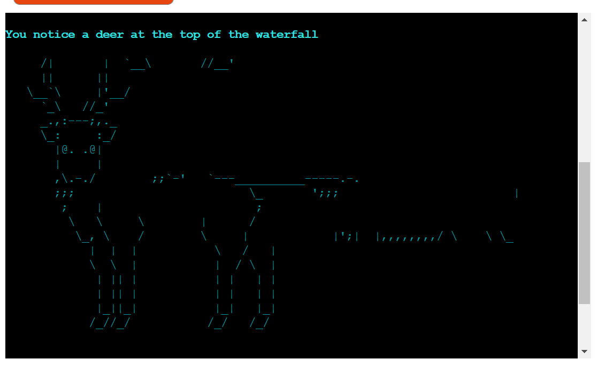 

### **Future Features**
- I want to implement a score tracking system for the game.
- Also, as the tracking system is implemented, this allows for a more complex story line with multiple scenarios.

## **Data model**
The start_game function gives way to the game_intro and from this the other 5 main functions of this game flow.
Each of these 5 functions represent a scenario where 
Each function has conditional statements to manage error and exception handling to guide the user to an appropiate answer of his choice. 
I've started planning for this game using a flowchart to help me create the flow and logic of the game functions. 
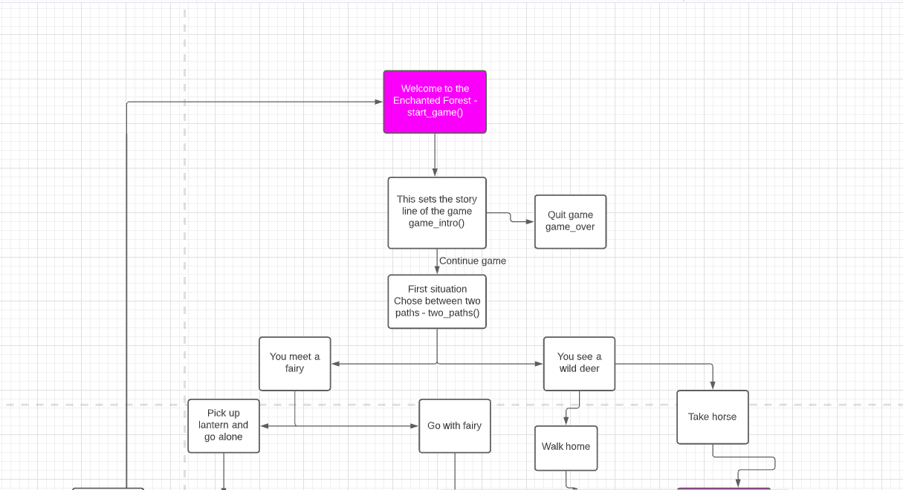
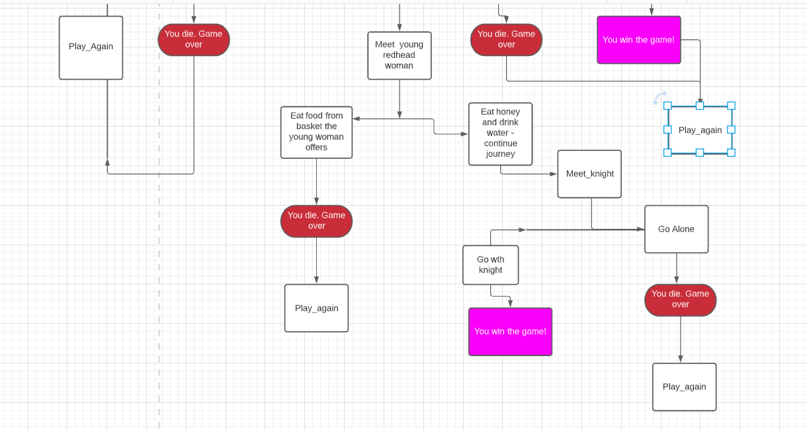

## **Testing**
I've tested this project manually using the following:
- I passed the code through Pep8 online code validator and confirmed that there are no major problems with the code.
- The code for the colorama styles made the lines too long so I needed to change these several times. However I've allowed 5 errors on the code, as I didn't find a feasible solution to applying the Bright Yellow color style and making the code smaller. 
- There are several warnings for 'trailing whitespace' and 'invalid escape sequence' which are caused by the Ascii text art I've included enclosed within literals. 
- I've successfully tested this project both in the Heroku terminal and on my local Gitpod terminal.

### **Bugs** 
### **Colorama module existing issue**
The main issue I've noticed is with the Colorama colors, there are usually not displaying the same on the terminal as they as on the Gitpod workspace. 
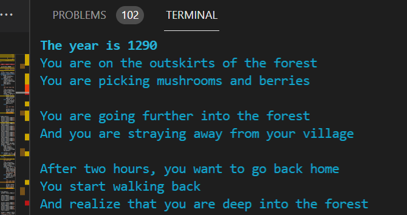 
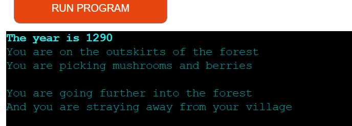 

- I've tried changing import code as per this - [Stack Overflow article](https://stackoverflow.com/questions/9848889/colorama-for-python-not-returning-colored-print-lines-on-windows) however this was not successful.

## **Deployment**
To deploy my website to Heroku, I've taken the following stps:
- Go to https://dashboard.heroku.com/apps
- Create an account
- From the Heroku dashboard click the “Create new app” button 
- Name app 'the-enchanted-forest'
- Go to Settings - under Config Vars set Key to PORT and VALUE to 8000
- Add buildpacks Python and Node.js and save after each
- Go to Deploy - chose automatic deployment 
- Notice message 'App was successfully deployed'
- Click on Open app button to open the newly deployed app

## ** Credits**
### **Coding Tutorials**
- [Make your own text based adventure game in Python3] (https://thecodingpie.com/post/make-your-own-text-based-adventure-game-in-python3)

- [Simple Python Project | Text-Based Adventure Game: Time Unraveled] (https://www.youtube.com/watch?v=ypNFNr72Xe8&list=PLeh6WLy2bEMGGBIU4y-aKyqJ-gIbIZfSU&index=8&t=2439s)
- [Choose Your Own Adventure Game in Python (Beginners)] (https://www.youtube.com/watch?v=DEcFCn2ubSg&list=PLeh6WLy2bEMGGBIU4y-aKyqJ-gIbIZfSU&index=6&t=1s)
- Code for clearing the terminal was taken from [Stack Overflow] (https://stackoverflow.com/questions/517970/how-to-clear-the-interpreter-console)

### **Ascii art**
The Ascii text art was taken from the following sources
- https://www.asciiart.eu/people/occupations/knights

- https://textart4u.blogspot.com/2012/03/deer-text-art-ascii-art.html

- I've used this website to generate all the Ascii texts in my oroject

https://patorjk.com/software/taag/#p=display&f=Standard&t=Discover%20a%20t

## **Acknoledgments**
I want to thank my mentor for guidance, tutors for answering my many questions regarding coding with Python and everyone at Code Institute who provided helpful tips along the way.

